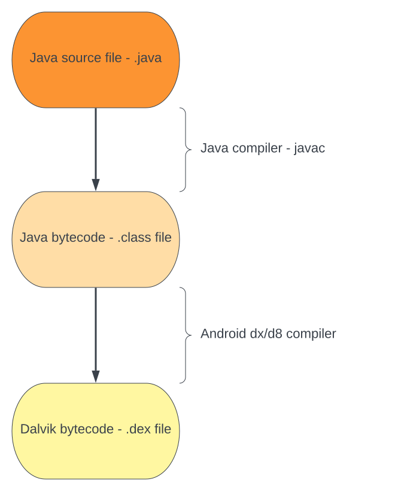
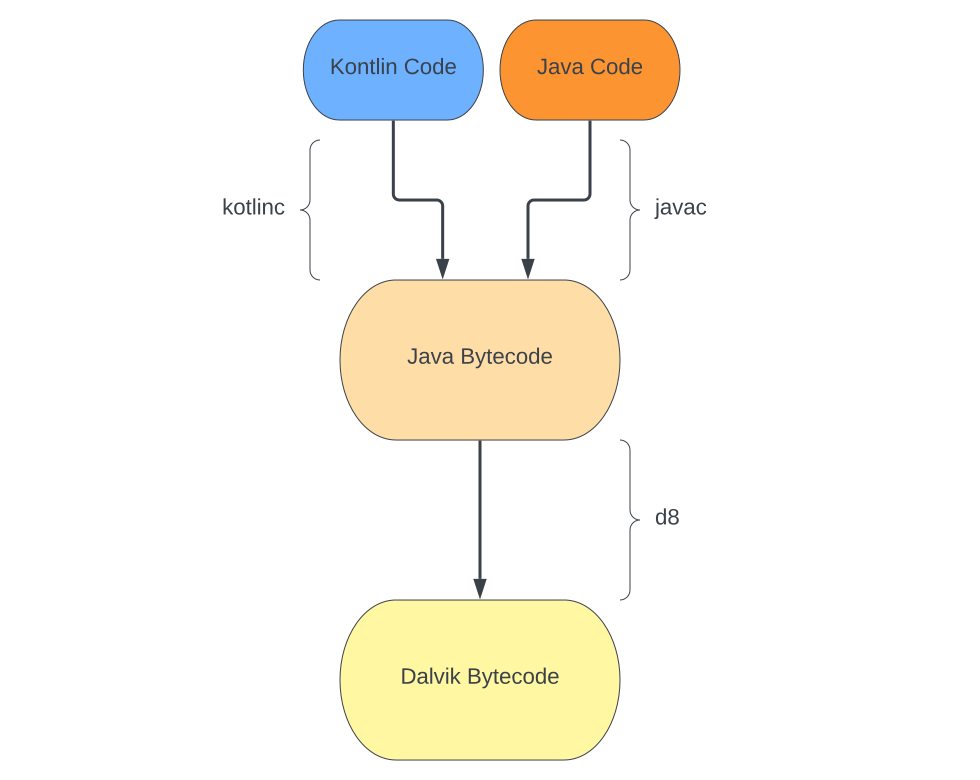
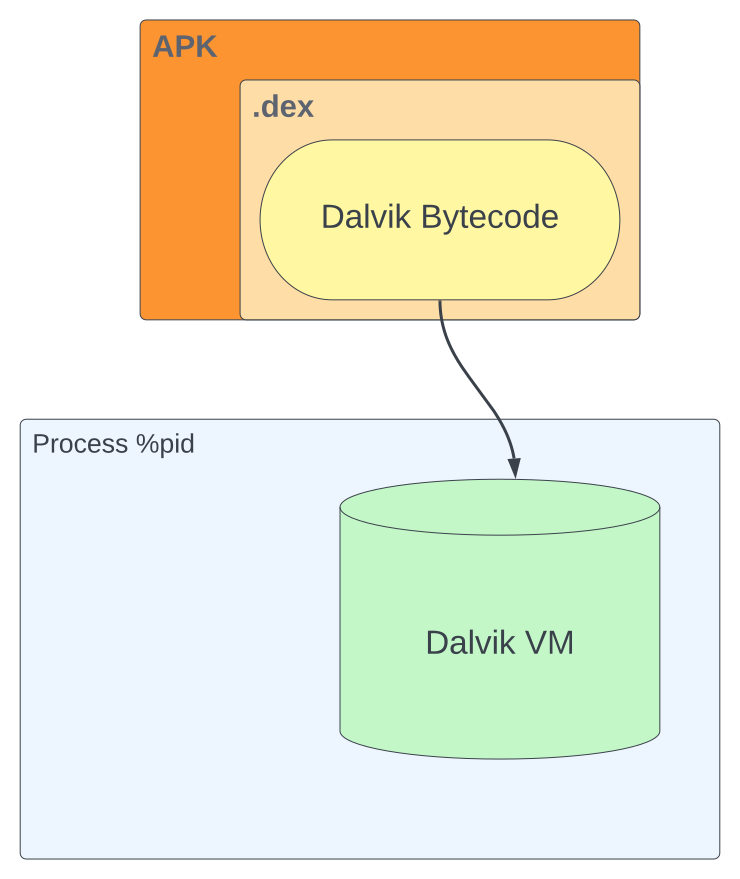
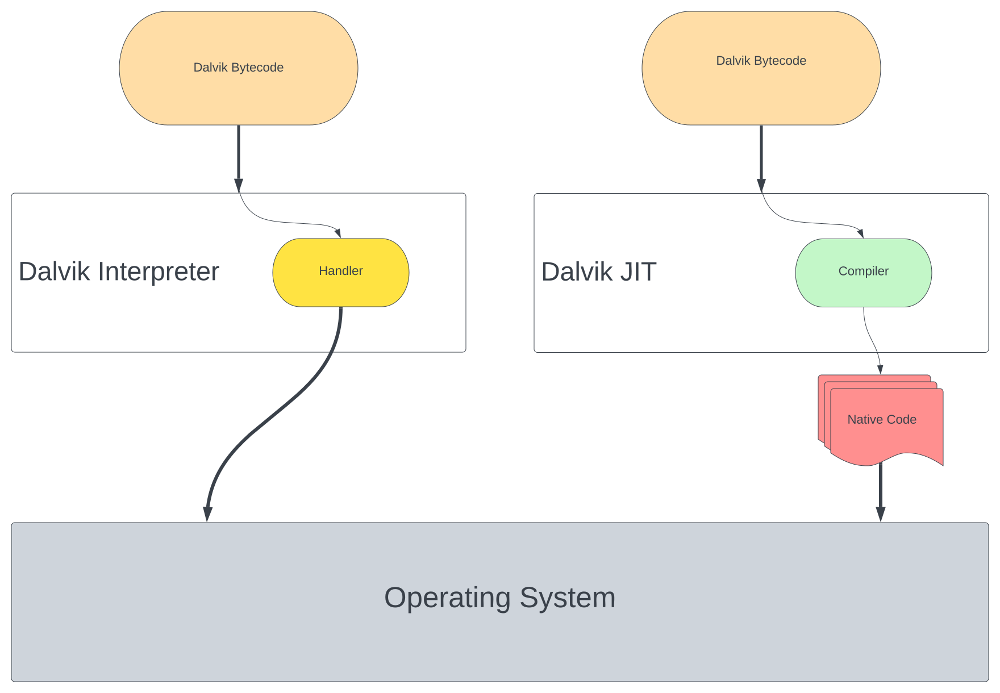
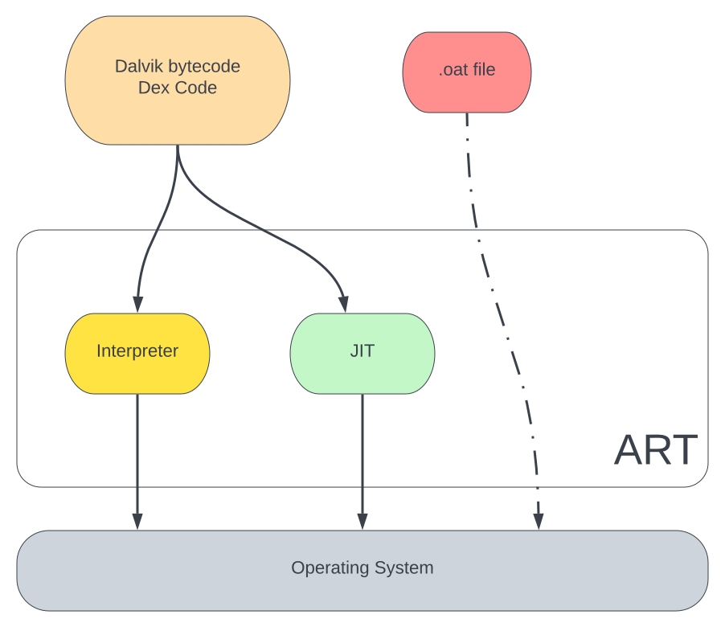

## **Introduction**

Let’s start our journey from the architecture of the [Android operating system](<https://en.wikipedia.org/wiki/Android_(operating_system)>) and its internals. This chapter covers the minimal information we need to know to feel comfortable working on topics covered in the following sections.

The [kernel](https://source.android.com/devices/architecture/kernel) used in Android is based on Linux, but with some significant additions, including [Low Memory Killer](https://source.android.com/devices/tech/perf/lmkd), wake locks, the Binder IPC driver, etc.

For our purposes, we are more interested in the user-mode part of the operating system, and here Android significantly differs from a typical Linux distribution, two important components for us are a managed runtime used by applications (`ART`/`Dalvik`) and Bionic, Android’s version of glibc, the GNU C library.

## **Runtime Environment on Android**

When we write an Android Application in Java or Kotlin, before execution, it is compiled to [`Dalvik bytecode`](https://source.android.com/devices/tech/dalvik/dalvik-bytecode), also known as `Dex Code`. To run the bytecode, it’s necessary to have a virtual machine, a runtime that intercepts the bytecode instructions and executes them on the target device. In the Java world, we have [JVM](https://en.wikipedia.org/wiki/Java_virtual_machine) (Java Virtual Machine). On the Microsoft side, .NET uses `Common Language Runtime (CLR)` virtual machine to manage the execution of .NET programs.

### Dalvik bytecode - Dex Code

Java source code, which is usually written by a developer, is compiled into `Java` bytecode (`.class` file) via `javac` compiler, after that, a `Dex compiler` such as `dx` or `d8` is used to convert it to `Dalvik bytecode` (`.dex` file), the file is called `Dalvik EXecutable(.DEX)`.



We will take this small snippet of `Java` code and see how it changes through these stages:

```java
// Java file - foo.java
class Foo {
  public static void main(String[] args) {
   example(10);
  }
  static int example(int num) {
    int a = 22;
    return a * num;
  }
}
```

We are using `javac` - Java Application Compiler to generate `Java bytecode` - `.class` file, and `javap` - Java Class File Disassembler to print out the bytecode:

```bash
$ javac foo.java
$ javap -p Foo.class
```

```java
// javap output - Java bytecode
{
  public static void main(java.lang.String[]);
    descriptor: ([Ljava/lang/String;)V
    flags: (0x0009) ACC_PUBLIC, ACC_STATIC
    Code:
      stack=1, locals=1, args_size=1
         0: bipush        10
         2: invokestatic  #2    // Method example:(I)I
         5: pop
         6: return
      LineNumberTable:
        line 3: 0
        line 4: 6

  static int example(int);
    descriptor: (I)I
    flags: (0x0008) ACC_STATIC
    Code:
      stack=2, locals=2, args_size=1
         0: bipush        22
         2: istore_1
         3: iload_1
         4: iload_0
         5: imul
         6: ireturn
      LineNumberTable:
        line 6: 0
        line 7: 3
}
```

From the output, we see `Java bytecode` instructions such as `bipush` and `iload_1`.

Now we need to compile the bytecode into `Dalvik bytecode` via `d8`:

```bash
$ d8 Foo.class
$ dexdump -d classes.dex
```

```java
Class #0            -
  Class descriptor  : 'LFoo;'
  ...

    #1              : (in LFoo;)
      name          : 'example'
      type          : '(I)I'
      access        : 0x0008 (STATIC)
      code          -
      registers     : 1
      ins           : 1
      outs          : 0
      insns size    : 4 16-bit code units
000118:                                        |[000118] Foo.example:(I)I
000128: 0000                                   |0000: nop // spacer
00012a: da00 0016                              |0001: mul-int/lit8 v0, v0, #int 22 // #16
00012e: 0f00                                   |0003: return v0

...

    #2              : (in LFoo;)
      name          : 'main'
      type          : '([Ljava/lang/String;)V'
      access        : 0x0009 (PUBLIC STATIC)
      code          -
      registers     : 1
      ins           : 1
      outs          : 1
      insns size    : 6 16-bit code units
000148:                                        |[000148] Foo.main:([Ljava/lang/String;)V
000158: 1300 0a00                              |0000: const/16 v0, #int 10 // #a
00015c: 7110 0100 0000                         |0002: invoke-static {v0}, LFoo;.example:(I)I // method@0001
000162: 0e00                                   |0005: return-void
...
```

At the `Dalvik bytecode` (`Dex Code`) stage, we still have architecture agnostic instructions, but they differ from the `Java bytecode` , `mul-int/lit8` single instruction is used instead of several ones from the previous bytecode. We can say that `Dalvik bytecode` is an optimized version of `Java bytecode`.

More modern apps are written in `Kotlin` instead of `Java`, flow is almost identical, just one minor change where Kotlin compiler - `kotlinc`, converts `.kt` files to Java-compatible bytecode:



### Dalvik VM and ART

`Dalvik bytecode` is packed within `APK` and `AAB` files in the form of `.dex` files and is used by a managed runtime on Android to execute it on the device. It’s now the runtime’s responsibility to handle the architecture agnostic intermediate language file - `Dex Executable File` (`.dex`). Such runtime is `Dalvik VM`, used by Android version 4.4 “KitKat” and earlier, Google abandoned `JVM` in favor of an alternative solution. `Dalvik Virtual Machine` is created by Dan Bornstein with constraints of mobile devices in mind. Each application runs in its own instance of the `Dalvik Virtual Machine`, so being efficient is crucial to concurrently run many such processes.



To translate the `Dalvik bytecode` into the device-specific instructions, `Dalvik VM` uses two approaches, `Dalvik interpreter` and `Dalvik JIT`.

`Dalvik Interpreter` can be found under `dalvik/vm/mterp` directory for source code of Android versions 4.4 and earlier. It fetches each instruction and redirects them using a table to the appropriate handler.

```c
...
#define H(_op) dvmMterp_##_op
DEFINE_GOTO_TABLE(gDvmMterpHandlers)
...
// C mterp entry point.
while (true) {
        ...
        u2 inst = /*self->interpSave.*/pc[0];
        ...
        Handler handler = (Handler) gDvmMterpHandlers[inst & 0xff];
        ...
        (*handler)(self);
}

// Example of an handler
#define HANDLE_OP_X_FLOAT_2ADDR(_opcode, _opname, _op)                      \
    HANDLE_OPCODE(_opcode /*vA, vB*/)                                       \
        vdst = INST_A(inst);                                                \
        vsrc1 = INST_B(inst);                                               \
        ILOGV("|%s-float-2addr v%d,v%d", (_opname), vdst, vsrc1);           \
        SET_REGISTER_FLOAT(vdst,                                            \
            GET_REGISTER_FLOAT(vdst) _op GET_REGISTER_FLOAT(vsrc1));        \
        FINISH(1);
```

`Dalvik JIT (Just-in-Time)` is a compiler for `Dalvik VM`, by tracing code execution and profiling, it identifies hot execution paths and translates them to native instructions. For the first time, all code is interpreted before a decision is made to compile some parts of it, after that the compiled code runs instead of the handlers.



Google build new managed runtime for Android called `ART` (`Android Runtime`) and entirely replaced `Dalvik` from Android 5.0 “Lollipop”. `ART` uses the same `Dalvik bytecode` input to maintain backward compatibility.

For our purposes, the most important feature introduced with `ART` is `Ahead-of-time (AOT)` compilation, which pre-compiles `Dalvik bytecode` into native code, and the generated code will be saved on disk with the `.oat` extension. `dex2oat` is a tool used to perform the compilation and can be found at `/system/bin/dex2oat` on Android devices.

`JIT` happens at runtime, `AOT` during the installation, or when the device is not in use, but this approach has a downside to prolonged application install time and operating system update time, due to it is necessary to recompile all applications.

To combat the downsides of `AOT`, recent versions of `ART runtime` use a hybrid approach with profile-guided compilation. After installation, all parts of the application will be interpreted and methods frequently executed will be `JIT` compiled, at the same time profiles getting generated to trace the frequently used code part. When the device is idle, a compilation (`dex2oat`) daemon runs, and `AOT` compiles code based on the generated profile from previous runs.



Some versions of Android also may get profiles from the cloud during downloading from the `Play Store` to improve user experience by using it to pre-compile classes and methods.

### Dalvik and ART Optimization

In `Dalvik VM` we have `.odex` files which contain optimized, device-specific bytecode instructions to get better interpreter performance, they are not portable even in different versions of `Dalvik VM`. The file is generated on a device by the `dexopt` tool and is saved under `$ANDROID_DATA/data/dalvik-cache` directory.

We have a similar concept in `ART`, but in this case, `.dex` files are AOT-compiled to binary code via the `dex2oat` tool. The main difference is that `dexopt` generates optimized bytecode, but `dex2oat` generates ELF binary file.
