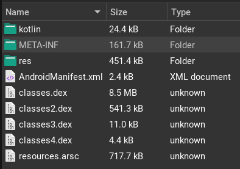
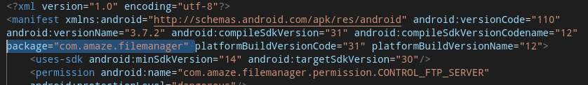
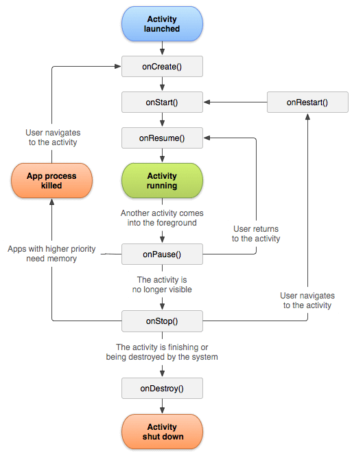

- [**Introduction**](#introduction)
- [APK - Android Application Package](#apk---android-application-package)
- [Android Manifest File](#android-manifest-file)
  - [Package name](#package-name)
  - [Activities](#activities)
  - [Services](#services)
  - [Broadcast Receivers](#broadcast-receivers)
  - [Content Providers](#content-providers)
  - [Application Element](#application-element)

---

## **Introduction**

Android applications are distributed in the form of [Android Application Package (.apk)](https://en.wikipedia.org/wiki/Apk_(file_format)) files, or more recently in the form of [Android App Bundle (.aab)](https://developer.android.com/guide/app-bundle) files. The package format is still `APK`, but the publishing format is changed to `.aab` to deliver optimized `APK` files to different devices. 

Let’s start with APK files.

## APK - Android Application Package

`APK` files are [zip](https://en.wikipedia.org/wiki/ZIP_(file_format)) archive files containing the resources, bytecodes, compiled library files, manifest file, etc. necessary to run an Android applications. An `APK` may have a similar structure: 



Important files for us are `.dex` files (`classes[i].dex`) and `AndroidManitefest.xml` file.

For demo purposes, I’m using an open-source application called **[Amaze File Manager](https://github.com/TeamAmaze/AmazeFileManager).**

## Android Manifest File

All Android applications contain an `AndroidManifest.xml` file with all necessary details to run the application. The file defines the components of the applications and entry points used to launch the components. For reverse engineers, it is important to know all possible entry points to make sure that we are aware of all possible execution paths.

The manifest file we're using for the reference: [AmazeFileManager’s manifest file](https://github.com/TeamAmaze/AmazeFileManager/blob/release/3.8/app/src/main/AndroidManifest.xml).

There are several useful details we need to know about the file’s content:

---

### Package name

In this case `com.amaze.filemanager` is a unique application name, we are unable to install two different apps with the same package name:



---

There is no `main` or a single entry point for the application, but different components with callback methods. Usually, there are several ways to interact with the app.

### Activities

We can think of activities as individual screens with a UI. This can be the main window, preferences window, editor window, about page, etc. In order to make applications work, there needs to be a way to communicate between components, and [Intents](https://developer.android.com/guide/components/intents-filters) are exactly used for that. 

[Intent filters](https://developer.android.com/guide/components/intents-filters) are used with activities to specify what kind of requests the activity component can respond.

In the code snippet, we use [action ‘send’](https://developer.android.com/reference/android/content/Intent#ACTION_SEND), which is used to send data from one activity to another, also it specifies the type of the data with [‘data’ element](https://developer.android.com/guide/topics/manifest/data-element). This means that `.ExampleActivity` class is able to send a plain text data.

```xml
<activity android:name=".ExampleActivity" android:icon="@drawable/app_icon">
    <intent-filter>
        <action android:name="android.intent.action.SEND" />
        <category android:name="android.intent.category.DEFAULT" />
        <data android:mimeType="text/plain" />
    </intent-filter>
</activity>
```

In our reference app, we have `TextEditorActivity` activity with code located at `com.amaze.filemanager.p005ui.activities.texteditor.TextEditorActivity`.  [View action](https://developer.android.com/reference/android/content/Intent#ACTION_VIEW) from the intent filter shows that the component is used to view data, also we can see file types the activity can handle. 

```xml
<activity android:theme="@style/appCompatBlack" android:label="@string/textreader" android:name="com.amaze.filemanager.p005ui.activities.texteditor.TextEditorActivity" android:configChanges="uiMode">
    <intent-filter android:label="Amaze Text Editor">
        <action android:name="android.intent.action.VIEW"/>
        <category android:name="android.intent.category.DEFAULT"/>
        <data android:mimeType="text/*"/>
        <data android:mimeType="application/javascript"/>
        <data android:mimeType="application/json"/>
        <data android:mimeType="application/xml"/>
    </intent-filter>
</activity>
```

The following Intent can be used to call the activity class:

```java
Intent newIntent = new Intent(Intent.ACTION_VIEW, pdfpage);
// Start the activity
startActivity(newIntent);
```

In this case, we have [category.DEFAULT](https://developer.android.com/reference/android/content/Intent#CATEGORY_DEFAULT) and there is no need to explicitly specify package name to handle the request, but the above-mentioned activity will be used.

One important action is [ACTION_MAIN](https://developer.android.com/reference/android/content/Intent#ACTION_MAIN) with category [LAUNCHER](https://developer.android.com/reference/android/content/Intent#CATEGORY_LAUNCHER), used to launch the main activity in an application, for example when we click an icon of the app:

```xml
<intent-filter android:label="@string/appbar_name">
    <action android:name="android.intent.action.MAIN"/>
    <category android:name="android.intent.category.LAUNCHER"/>
</intent-filter>
```

The following diagram shows different states of an activity and [callbacks](https://developer.android.com/reference/android/app/Activity#onCreate(android.os.Bundle)) a developer can implement. [onCreate](https://developer.android.com/reference/android/app/Activity#onCreate(android.os.Bundle)) callback is usually used to initialize the component logic.



---

### Services

A [Services](https://developer.android.com/guide/components/services) are declared in the manifest file and running in the background without UI, the following snippet is from the reference application:

```xml
<service android:label="Copying" android:name="com.amaze.filemanager.asynchronous.services.CopyService"/>
<service android:name="com.amaze.filemanager.asynchronous.services.ftp.FtpService" android:permission="com.amaze.filemanager.permission.CONTROL_FTP_SERVER" android:enabled="true" android:exported="true"/>
```

The first service `Copying` can be called similarly to activities, but using [startService](https://developer.android.com/reference/android/content/Context#startService(android.content.Intent)) instead of [startActivity](https://developer.android.com/reference/android/content/Context#startActivity(android.content.Intent,%20android.os.Bundle)):

```java
Intent intent = new Intent(this.context.get(), CopyService.class);
intent.putParcelableArrayListExtra("FILE_PATHS", sourceFiles);
intent.putExtra("COPY_DIRECTORY", target);
intent.putExtra("MODE", openmode.ordinal());
intent.putExtra("move", this.move);
intent.putExtra("is_root", this.rootMode);
... 
context.startService(intent);
```

`android:exported="true"` is used to specify if the service component can be used by another application. 

---

### Broadcast Receivers

A broadcast receiver is one of the application components and responds to different types of events, called broadcasts. For example,  an application can register [ACTION_BOOT_COMPLETED](https://developer.android.com/reference/android/content/Intent#ACTION_BOOT_COMPLETED) (`android.intent.action.BOOT_COMPLETED`) broadcast and execute code after booting of a device finishes.

There are two ways to register broadcast receiver: statically in the manifest, or dynamically in an activity component. 

Register a broadcast receiver via the manifest file:

```xml
<receiver android:name=".BootReceiver"  android:exported="true">
    <intent-filter>
        <action android:name="android.intent.action.BOOT_COMPLETED"/>
    </intent-filter>
</receiver>
```

Alternatively, we can register it dynamically from an activity:

```java
context.registerReceiver(receiver, new IntentFilter(Intent.ACTION_BATTERY_CHANGED));
```

**[onReceive](https://developer.android.com/reference/android/content/BroadcastReceiver#onReceive(android.content.Context,%20android.content.Intent))** callback is called when a specified event will occur on the device.

```java
@Override
public void onReceive(Context context, Intent intent)
{
  super.onReceive(context, intent);
  Log.d(TAG, "onReceive()" + intent.getAction());
}
```

### Content Providers

Content Providers create an interface to access shared data. For example, [Contacts provider](https://developer.android.com/guide/topics/providers/contacts-provider) is a good example for such functionality. Much like other components, a custom content provider can be declared from the manifest file. The component is not essential for us, but if you wish to learn more about it, you can read [Content provider basics](https://developer.android.com/guide/topics/providers/content-provider-basics) page.

---

It’s important to understand above-mentioned components, since they declare different entry points for the application.

---

### Application Element

Another way to have an early entry point is to extend the [Application](https://developer.android.com/reference/android/app/Application.html#summary) class and implement the [onCreate](https://developer.android.com/reference/android/app/Application.html#onCreate()) method, which will execute earlier than the above-mentioned components.

```xml
<manifest ...
    <application
         android:name="com.package.example.myapp">
        <activity>
            <!-- ... -->
        </activity>
    </application>
</manifest>
```

```java
public class MyApp extends Application {
    public MyApp() {
        // ctor is called when the app is created
    }

    @Override
    public void onCreate() {
        super.onCreate();
        // onCreate is called when the app is created
        // ...
    }
}
```

---